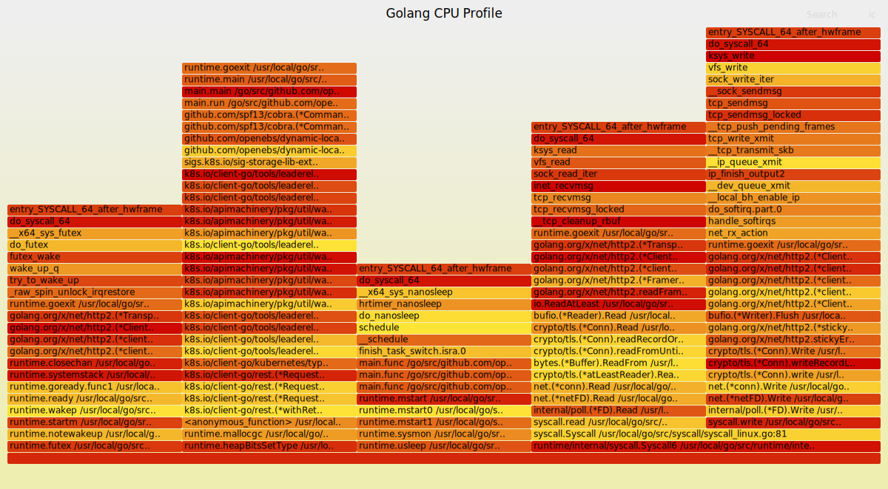

# golang-profiling

[中文文档](README_zh.md) | English

🔥 A high-performance Golang application profiling tool based on eBPF technology, capable of generating interactive flame graphs for performance analysis.

## ✨ Features

- 🚀 **Zero-overhead profiling**: Uses eBPF technology for minimal performance impact
- 🎯 **Precise stack tracing**: Captures complete call stacks with symbol resolution
- 🔥 **Interactive flame graphs**: Generates SVG flame graphs with zoom and search capabilities
- 🎨 **Customizable visualization**: Supports various color schemes and layout options
- 📊 **Multiple output formats**: SVG flame graphs and folded stack traces
- 🔧 **Flexible targeting**: Profile by PID, process name, or system-wide
- ⚡ **Real-time analysis**: Live profiling with configurable sampling rates

## 🛠️ System Requirements

- **Operating System**: Linux (kernel version >= 4.4)
- **Architecture**: x86_64, aarch64
- **Privileges**: Root access or CAP_BPF capability
- **Dependencies**: 
  - Rust toolchain (>= 1.70)
  - LLVM/Clang (>= 10.0)
  - Linux headers
  - Perl (for flame graph generation)

## 📦 Installation

### Install Rust Toolchain

```bash
curl --proto '=https' --tlsv1.2 -sSf https://sh.rustup.rs | sh
source ~/.cargo/env
```

### Install System Dependencies

**Ubuntu/Debian:**
```bash
sudo apt update
sudo apt install -y clang llvm libelf-dev libz-dev pkg-config linux-headers-$(uname -r) perl
```

**CentOS/RHEL/Fedora:**
```bash
# CentOS/RHEL
sudo yum install -y clang llvm elfutils-libelf-devel zlib-devel pkgconfig kernel-headers perl

# Fedora
sudo dnf install -y clang llvm elfutils-libelf-devel zlib-devel pkgconfig kernel-headers perl
```

**Arch Linux:**
```bash
sudo pacman -S clang llvm libelf zlib pkgconf linux-headers perl
```

### Install bpf-linker

```bash
cargo install bpf-linker
```

## 🚀 Build

```bash
git clone <repository-url>
cd golang-profile
cargo build --release
```

The compiled binary will be available at `target/release/golang-profiling`.

## 📖 Usage

### Basic Usage

```bash
# Profile by PID
sudo ./target/release/golang-profiling --pid 1234 --duration 10 --output profile.svg

# Profile by process name
sudo ./target/release/golang-profiling --name "my-go-app" --duration 30 --output app_profile.svg

# System-wide profiling
sudo ./target/release/golang-profiling --duration 5 --output system_profile.svg
```

### Command Line Options

| Parameter | Description | Default | Example |
|-----------|-------------|---------|----------|
| `--pid` | Target process PID | - | `--pid 1234` |
| `--name` | Target process name | - | `--name "golang-app"` |
| `--duration` | Profiling duration (seconds) | 10 | `--duration 30` |
| `--frequency` | Sampling frequency (Hz) | 99 | `--frequency 199` |
| `--output` | Output SVG file path | `flamegraph.svg` | `--output profile.svg` |
| `--folded-output` | Output folded stack file | - | `--folded-output stacks.folded` |

### Flame Graph Customization

| Parameter | Description | Default | Example |
|-----------|-------------|---------|----------|
| `--title` | Flame graph title | "Flame Graph" | `--title "My App Profile"` |
| `--subtitle` | Flame graph subtitle | - | `--subtitle "CPU Profile"` |
| `--colors` | Color scheme | `hot` | `--colors java` |
| `--bgcolors` | Background colors | - | `--bgcolors blue` |
| `--width` | Image width | 1200 | `--width 1600` |
| `--height` | Row height | 16 | `--height 20` |
| `--fonttype` | Font family | `Verdana` | `--fonttype Arial` |
| `--fontsize` | Font size | 12 | `--fontsize 14` |
| `--inverted` | Invert flame graph | false | `--inverted` |
| `--flamechart` | Generate flame chart | false | `--flamechart` |
| `--hash` | Consistent colors | false | `--hash` |
| `--random` | Random colors | false | `--random` |

### Usage Examples

#### 1. Basic Process Profiling
```bash
sudo ./target/release/golang-profiling --pid 1234 --duration 10 --output basic_profile.svg
```

#### 2. High-Frequency Sampling
```bash
sudo ./target/release/golang-profiling --name "my-service" --frequency 199 --duration 30 --output detailed_profile.svg
```

#### 3. Custom Styled Flame Graph
```bash
sudo ./target/release/golang-profiling \
  --pid 1234 \
  --duration 15 \
  --title "Production Service Profile" \
  --subtitle "CPU Usage Analysis" \
  --colors java \
  --width 1600 \
  --height 20 \
  --fontsize 14 \
  --output custom_profile.svg
```

#### 4. Inverted Flame Graph (Icicle Graph)
```bash
sudo ./target/release/golang-profiling --pid 1234 --inverted --title "Icicle Graph" --output icicle.svg
```

#### 5. Export Both SVG and Folded Format
```bash
sudo ./target/release/golang-profiling \
  --pid 1234 \
  --duration 20 \
  --output profile.svg \
  --folded-output profile.folded
```

## 📊 Output Files

- **SVG Flame Graph**: Interactive flame graph that can be opened in browsers, supports click-to-zoom and search
- **Folded Stack File**: Text format raw data that can be used with other analysis tools

### Example Flame Graph

Here's an example flame graph generated by this tool:



> 💡 **Tip**: Click on the flame graph above to view the full interactive version with zoom and search capabilities.

## 🔍 Performance Analysis Tips

1. **Choose Appropriate Sampling Frequency**: 
   - High frequency (199Hz+): Suitable for short-term precise analysis
   - Low frequency (49Hz-99Hz): Suitable for long-term monitoring

2. **Recommended Duration**:
   - Development environment: 5-10 seconds
   - Production environment: 30-60 seconds

3. **Reading Flame Graphs**:
   - X-axis: Functions sorted alphabetically (not time)
   - Y-axis: Call stack depth
   - Width: Proportion of CPU time consumed by function

## 🔧 Troubleshooting

### Common Issues

1. **Permission Denied**
   ```
   Error: Permission denied
   ```
   Solution: Run with `sudo` or ensure user has CAP_BPF capability

2. **Process Not Found**
   ```
   Error: Process not found
   ```
   Solution: Check if the process PID or name is correct

3. **eBPF Not Supported**
   ```
   Error: BPF program load failed
   ```
   Solution: Ensure kernel version >= 4.4 and eBPF support is enabled

4. **Missing Dependencies**
   ```
   Error: flamegraph.pl not found
   ```
   Solution: Ensure Perl is installed and flamegraph.pl is in the project directory

## 📄 License

This project is licensed under multiple licenses:
- Apache License 2.0
- MIT License  
- GPL v2 License

## 🤝 Contributing

Contributions are welcome! Please feel free to submit Issues and Pull Requests.

## 🔗 Related Projects

- [FlameGraph](https://github.com/brendangregg/FlameGraph) - Brendan Gregg's flame graph tools
- [aya](https://github.com/aya-rs/aya) - Rust eBPF library
- [perf](https://perf.wiki.kernel.org/) - Linux profiling tool
- [bpftrace](https://github.com/iovisor/bpftrace) - High-level tracing language for eBPF

---

**Happy Profiling! 🔥**