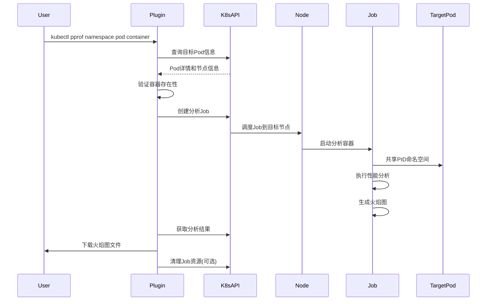

# kubectl-pprof 插件设计文档

## 1. 项目概述

### 1.1 项目目标
开发一个kubectl插件，用于在Kubernetes环境中对容器内的Go应用程序进行性能分析，生成火焰图。

### 1.2 核心功能
- 通过kubectl命令行接口进行性能分析
- 支持指定目标namespace、pod和container
- 使用Job方式在目标节点上运行分析工具
- 支持containerd运行时
- 共享PID命名空间进行进程分析
- 输出火焰图到指定位置
- 支持自定义分析工具镜像

### 1.3 命令行接口
```bash
kubectl pprof [flags] <namespace> <pod> [container]

Flags:
  -o, --output string        输出火焰图文件路径 (默认: flamegraph.svg)
  -d, --duration duration    分析持续时间 (默认: 30s)
  -i, --image string         分析工具镜像地址 (默认: golang-profiling:latest)
  -n, --node string          强制指定运行节点
      --job-name string      Job名称前缀 (默认: kubectl-pprof)
      --cleanup              分析完成后清理Job资源
      --timeout duration     Job超时时间 (默认: 5m)
```

## 2. 技术架构

### 2.1 技术栈
- **语言**: Go 1.21+
- **Kubernetes客户端**: client-go
- **容器运行时**: containerd (通过CRI)
- **性能分析**: 集成现有的golang-profiling工具
- **部署方式**: Kubernetes Job
- **命名空间共享**: PID namespace sharing

### 2.2 架构组件

```
┌─────────────────┐    ┌──────────────────┐    ┌─────────────────┐
│   kubectl CLI   │───▶│  kubectl-pprof   │───▶│  Kubernetes API │
│                 │    │     Plugin       │    │     Server      │
└─────────────────┘    └──────────────────┘    └─────────────────┘
                                │
                                ▼
                       ┌──────────────────┐
                       │   Target Node    │
                       │  ┌─────────────┐ │
                       │  │ Profiling   │ │
                       │  │    Job      │ │
                       │  │             │ │
                       │  │ ┌─────────┐ │ │
                       │  │ │ Target  │ │ │
                       │  │ │   Pod   │ │ │
                       │  │ │         │ │ │
                       │  │ └─────────┘ │ │
                       │  └─────────────┘ │
                       └──────────────────┘
```

### 2.3 核心模块

#### 2.3.1 CLI模块 (cmd/)
- 命令行参数解析
- 配置验证
- 用户交互界面

#### 2.3.2 Kubernetes客户端模块 (pkg/k8s/)
- 集群连接管理
- API资源操作
- 事件监听

#### 2.3.3 容器发现模块 (pkg/discovery/)
- Pod定位和验证
- 容器信息获取
- 节点调度决策

#### 2.3.4 Job管理模块 (pkg/job/)
- Job资源创建和管理
- 生命周期控制
- 状态监控

#### 2.3.5 分析执行模块 (pkg/profiler/)
- 性能分析任务编排
- 数据收集和处理
- 结果输出管理

## 3. 详细设计

### 3.1 工作流程



### 3.2 Pod发现和验证

```go
type PodDiscovery struct {
    client kubernetes.Interface
}

type TargetInfo struct {
    Namespace     string
    PodName       string
    ContainerName string
    NodeName      string
    PodUID        string
    ContainerID   string
}

func (pd *PodDiscovery) DiscoverTarget(namespace, podName, containerName string) (*TargetInfo, error) {
    // 1. 获取Pod信息
    // 2. 验证Pod状态(Running)
    // 3. 验证容器存在
    // 4. 获取节点信息
    // 5. 获取容器运行时信息
}
```

### 3.3 Job资源定义

```yaml
apiVersion: batch/v1
kind: Job
metadata:
  name: kubectl-pprof-{random-suffix}
  namespace: {target-namespace}
spec:
  ttlSecondsAfterFinished: 300
  template:
    spec:
      nodeName: {target-node}
      shareProcessNamespace: true
      containers:
      - name: profiler
        image: {profiler-image}
        command: ["/bin/sh"]
        args:
        - -c
        - |
          # 等待目标容器启动
          while ! pgrep -f {target-process}; do sleep 1; done
          # 执行性能分析
          golang-profiling --pid $(pgrep -f {target-process}) \
            --duration {duration} \
            --output /shared/flamegraph.svg
        volumeMounts:
        - name: shared-data
          mountPath: /shared
        securityContext:
          privileged: true
      - name: target-sidecar
        image: {target-pod-image}
        command: ["sleep", "infinity"]
        # 复制目标容器的配置以共享PID命名空间
      volumes:
      - name: shared-data
        emptyDir: {}
      restartPolicy: Never
```

### 3.4 命名空间共享策略

#### 3.4.1 PID命名空间共享
- 使用`shareProcessNamespace: true`
- 在Job中创建sidecar容器模拟目标容器环境
- 通过进程名称或PID查找目标进程

#### 3.4.2 网络命名空间(可选)
- 如果需要网络分析，可以共享网络命名空间
- 使用`hostNetwork: true`或Pod网络

#### 3.4.3 文件系统访问
- 挂载必要的主机路径(/proc, /sys等)
- 使用privileged模式获取系统权限

### 3.5 容器运行时集成

#### 3.5.1 containerd支持
```go
type ContainerdClient struct {
    client *containerd.Client
}

func (c *ContainerdClient) GetContainerInfo(containerID string) (*ContainerInfo, error) {
    // 1. 连接containerd socket
    // 2. 获取容器详细信息
    // 3. 获取进程PID
    // 4. 获取命名空间信息
}
```

#### 3.5.2 CRI接口支持
```go
type CRIClient struct {
    client criapi.RuntimeServiceClient
}

func (c *CRIClient) InspectContainer(containerID string) (*criapi.ContainerStatus, error) {
    // 使用CRI接口获取容器状态
}
```

### 3.6 性能分析集成

#### 3.6.1 golang-profiling工具集成
```go
type ProfilerConfig struct {
    Duration    time.Duration
    OutputPath  string
    TargetPID   int
    ProfileType string // cpu, memory, etc.
}

type Profiler struct {
    config ProfilerConfig
}

func (p *Profiler) RunProfiling() error {
    // 1. 验证目标进程存在
    // 2. 执行性能分析
    // 3. 生成火焰图
    // 4. 保存结果文件
}
```

#### 3.6.2 多种分析类型支持
- CPU分析
- 内存分析
- Goroutine分析
- 阻塞分析

### 3.7 结果输出和管理

#### 3.7.1 文件传输
```go
type ResultManager struct {
    k8sClient kubernetes.Interface
}

func (rm *ResultManager) DownloadResult(jobName, namespace, outputPath string) error {
    // 1. 等待Job完成
    // 2. 从Pod中复制结果文件
    // 3. 保存到本地路径
    // 4. 验证文件完整性
}
```

#### 3.7.2 多种输出格式
- SVG火焰图
- 原始性能数据
- JSON格式报告

## 4. 错误处理和容错

### 4.1 常见错误场景
- 目标Pod不存在或不在Running状态
- 指定的容器不存在
- 节点资源不足无法调度Job
- 权限不足无法访问容器
- 性能分析工具执行失败

### 4.2 容错机制
- 重试机制：对临时性错误进行重试
- 超时控制：设置合理的超时时间
- 资源清理：确保失败时清理创建的资源
- 详细日志：提供详细的错误信息和调试日志

## 5. 安全考虑

### 5.1 权限要求
- 需要创建Job的权限
- 需要访问目标Pod的权限
- 需要在节点上运行特权容器的权限

### 5.2 安全限制
- 限制可访问的命名空间
- 验证用户权限
- 审计分析操作

## 6. 性能优化

### 6.1 资源使用优化
- 合理设置Job资源限制
- 优化镜像大小
- 减少不必要的文件传输

### 6.2 并发控制
- 限制同时运行的分析Job数量
- 避免对同一Pod的重复分析

## 7. 扩展性设计

### 7.1 插件化架构
- 支持多种性能分析工具
- 可扩展的输出格式
- 可配置的分析策略

### 7.2 多运行时支持
- containerd
- Docker
- CRI-O

## 8. 测试策略

### 8.1 单元测试
- 核心逻辑模块测试
- Mock Kubernetes API
- 错误场景测试

### 8.2 集成测试
- 真实Kubernetes环境测试
- 端到端功能测试
- 性能基准测试

## 9. 部署和分发

### 9.1 插件安装
- 通过krew插件管理器分发
- 直接二进制文件安装
- 容器化部署

### 9.2 依赖管理
- 分析工具镜像预构建
- 多架构支持
- 版本兼容性管理

## 10. 监控和可观测性

### 10.1 操作日志
- 详细的操作日志记录
- 结构化日志格式
- 日志级别控制

### 10.2 指标收集
- 分析任务成功率
- 执行时间统计
- 资源使用情况

## 11. 实现计划

### Phase 1: 基础框架
- [ ] 项目结构搭建
- [ ] CLI框架实现
- [ ] Kubernetes客户端集成

### Phase 2: 核心功能
- [ ] Pod发现和验证
- [ ] Job管理模块
- [ ] 基础性能分析

### Phase 3: 高级功能
- [ ] 多运行时支持
- [ ] 高级分析选项
- [ ] 结果管理优化

### Phase 4: 完善和优化
- [ ] 错误处理完善
- [ ] 性能优化
- [ ] 文档和测试